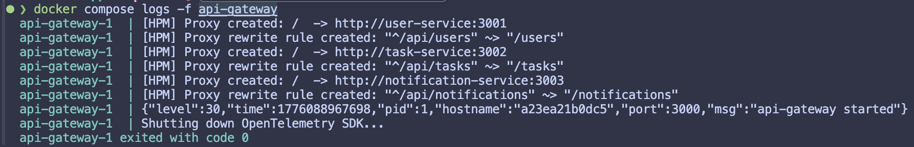
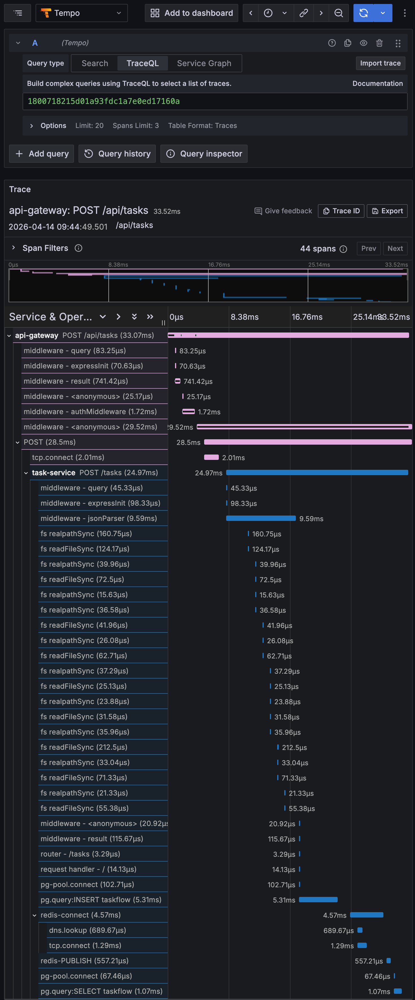
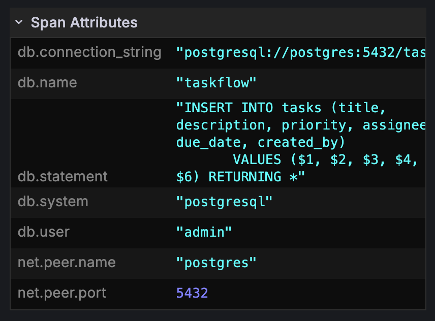
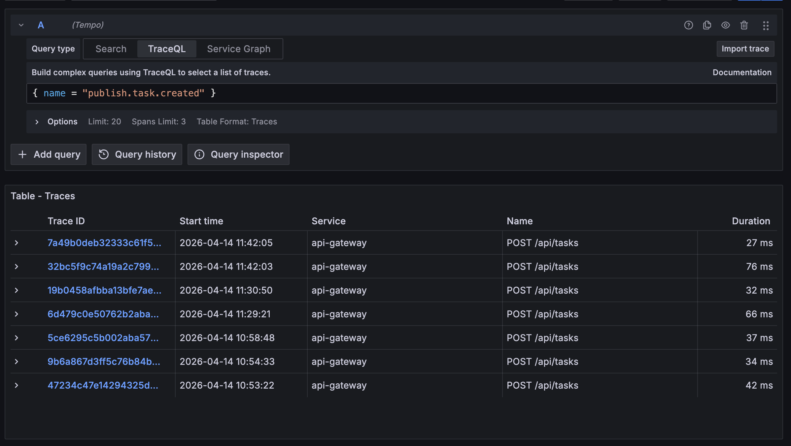
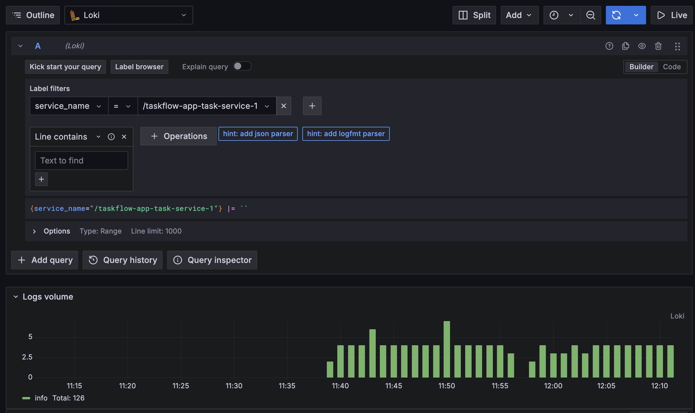
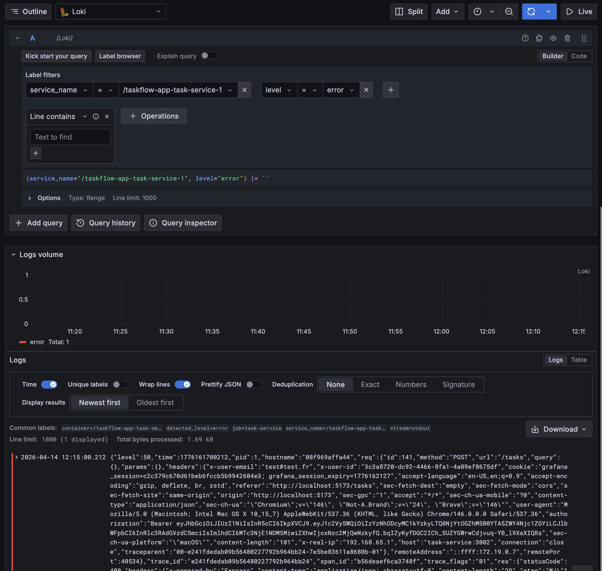
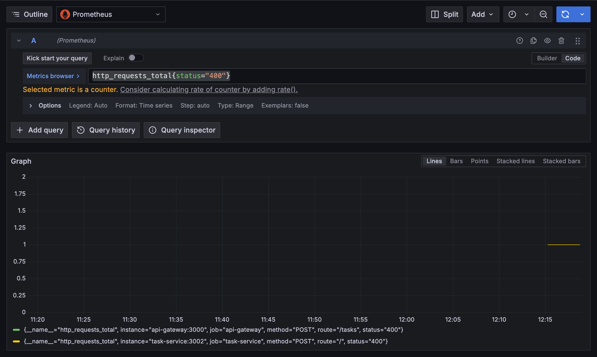
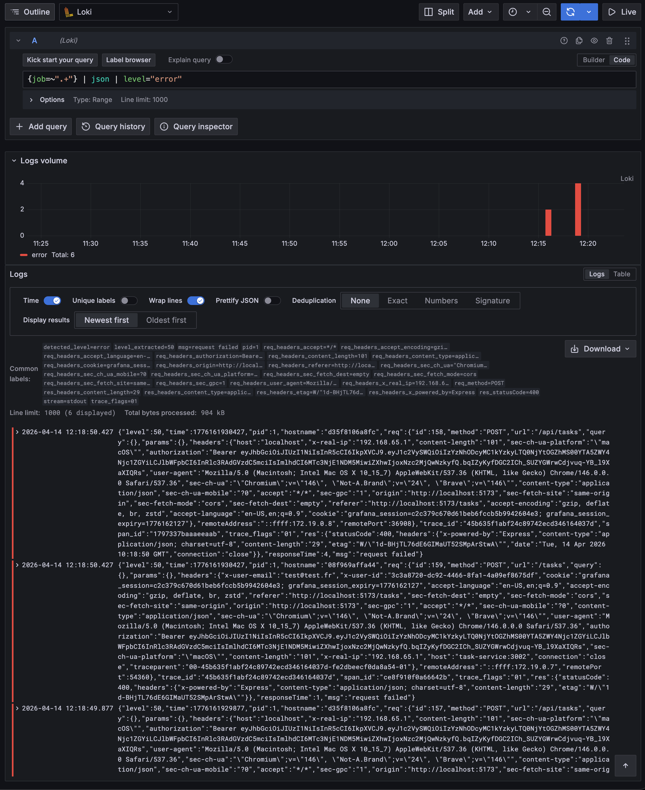
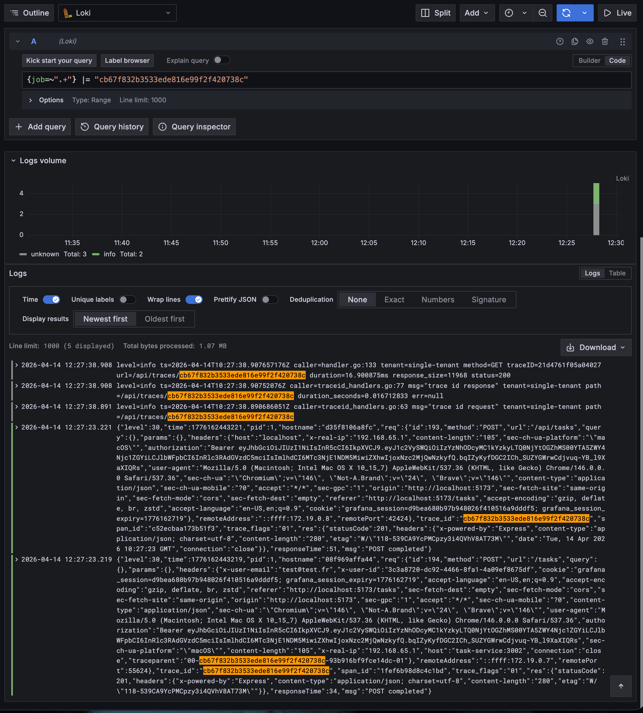

## A. Instrumenter l'application

### SDK OpenTelemetry — `tracing.js`

Chaque service expose un fichier `src/tracing.js` qui :

1. **Initialise le SDK** avec `NodeSDK`
2. **Déclare la ressource** via `new Resource({ SERVICE_NAME: serviceName })` — permet d'identifier le service dans Tempo/Grafana
3. **Exporte les traces** vers l'OTel Collector en OTLP HTTP (`/v1/traces`)
4. **Active les auto-instrumentations** HTTP, Express et PG via `getNodeAutoInstrumentations`
5. **Gère le shutdown proprement** : écoute `SIGTERM` et `SIGINT`, appelle `sdk.shutdown()` pour vider les buffers de traces/métriques avant de quitter

Le fichier est chargé en premier dans chaque `index.js` via `require("./tracing")` (première ligne), ce qui garantit que l'instrumentation est active avant tout démarrage de service.

S'assurer qu'en cas de shutdown, les traces et métriques en attente soient bien exportées :


Il faut se gréffer sur l'évènement shutdown du process pour faire un `sdk.shutdown()`

---

### OTel Collector — `infra/otel/config.yml`

Le collector est configuré avec :

1. **Receivers** : `otlp` avec les deux protocoles — gRPC (port 4317) et HTTP (port 4318)
2. **Exporter Tempo** : `otlp/tempo` en gRPC vers `tempo:4317` (plus performant qu'HTTP pour du backend-to-backend), TLS désactivé en local
3. **Exporter console** : `debug` pour inspecter les traces/métriques en développement
4. **Métriques internes** : exposées sur `0.0.0.0:8888` via `service.telemetry.metrics`, scrapable par Prometheus
5. **Pipelines** :
   - `traces` : `otlp` → `batch` → `[otlp/tempo, debug]`
   - `metrics` : `otlp` → `batch` → `[debug]`

---

### Tempo — `infra/tempo/tempo.yml`

1. **API/UI sur le port 3200** : `server.http_listen_port: 3200` — c'est l'adresse que Grafana utilise comme datasource Tempo
2. **Réception gRPC** : `distributor.receivers.otlp.protocols.grpc` sur `0.0.0.0:4317` — protocole plus performant qu'HTTP pour la communication OTel Collector → Tempo
3. **Stockage local** : `storage.trace.backend: local` avec `path: /tmp/tempo/traces`
4. **Write-Ahead Log** : `wal.path: /tmp/tempo/wal` — buffer temporaire sur disque qui protège les traces en cas de crash avant leur écriture définitive

---

### Prometheus — `infra/prometheus/prometheus.yml`

**Config globale** : `scrape_interval: 15s` et `evaluation_interval: 15s` — Prometheus scrape les cibles toutes les 15 secondes.

**Scrape configs** :

| job_name | target |
|---|---|
| `prometheus` | `localhost:9090` (auto-scrape) |
| `api-gateway` | `api-gateway:3000` |
| `user-service` | `user-service:3001` |
| `task-service` | `task-service:3002` |
| `notification-service` | `notification-service:3003` |
| `otel-collector` | `otel-collector:8888` |

Chaque service expose un endpoint `/metrics` en format Prometheus. Le collector OTel expose ses métriques internes sur le port 8888 (configuré via `service.telemetry.metrics` dans `infra/otel/config.yml`).

---

### Grafana — provisioning automatique

#### Datasources — `infra/grafana/provisioning/datasources/datasources.yml`

Grafana charge automatiquement les datasources au démarrage via le système de provisioning. Deux datasources sont configurées :

- **Prometheus** (`http://prometheus:9090`) — définie comme datasource par défaut (`isDefault: true`)
- **Tempo** (`http://tempo:3200`) — port 3200 configuré dans `tempo.yml`

#### Dashboards — `infra/grafana/provisioning/dashboard/dashboard.yml`

Le provider `file` indique à Grafana de charger tous les JSON présents dans `/var/lib/grafana/dashboards` au démarrage. Ce dossier sera monté via un volume Docker pointant vers `infra/grafana/dashboards/`.

---

### docker-compose.infra.yml

#### Services et dépendances

| Service | Image | Ports exposés |
|---|---|---|
| `tempo` | `grafana/tempo:latest` | `3200` (API/UI) |
| `otel-collector` | `otel/opentelemetry-collector-contrib:latest` | `4317` gRPC, `4318` HTTP, `8888` métriques internes |
| `prometheus` | `prom/prometheus:latest` | `9090` |
| `grafana` | `grafana/grafana:latest` | `3100` → `3000` |

#### Chaîne de dépendances

```
tempo
  └── otel-collector (depends_on: tempo)
        └── prometheus (depends_on: otel-collector)
              └── grafana (depends_on: prometheus + tempo)
```

Tempo doit démarrer en premier car l'OTel Collector lui envoie des traces dès le lancement. Prometheus dépend du collector pour scraper ses métriques internes. Grafana attend Prometheus et Tempo pour que ses datasources soient disponibles.

---

## B. Visualisation de l'application

### Métriques métier

Ajout des metrics customs dans chaque services.

### Traces

#### Scénario : POST /api/tasks

Requête émise depuis le frontend → api-gateway → task-service → PostgreSQL.

Scénario de création d'une tâche.


#### Chaîne de spans observée

```
api-gateway   POST /api/tasks
  └── task-service   POST /tasks
        └── pg   INSERT INTO taskflow
```

Chaque service produit ses propres spans, reliés par un **traceId commun** propagé via les headers HTTP (`traceparent`). L'auto-instrumentation OTel s'occupe de la propagation sans code supplémentaire.

#### Attributs expliqués

**Spans HTTP (instrumentation Express/HTTP)**

| Attribut | Exemple | Description |
|---|---|---|
| `http.method` | `POST` | Méthode HTTP de la requête |
| `http.route` | `/tasks` | Route Express matchée (pattern, pas l'URL réelle) |
| `http.target` | `/tasks` | Path complet avec query string |
| `http.status_code` | `201` | Code de réponse HTTP |
| `http.url` | `http://task-service:3002/tasks` | URL complète côté client |
| `net.peer.name` | `task-service` | Hôte cible du span client |
| `span.kind` | `SERVER` / `CLIENT` | `SERVER` pour le service qui reçoit, `CLIENT` pour celui qui émet |

**Spans PostgreSQL (instrumentation pg)**

| Attribut | Exemple | Description |
|---|---|---|
| `db.system` | `postgresql` | Système de base de données |
| `db.name` | `taskflow` | Nom de la base |
| `db.statement` | `INSERT INTO tasks ...` | Requête SQL exécutée — utile pour détecter les N+1 ou les requêtes lentes |
| `db.operation` | `INSERT` | Type d'opération |
| `net.peer.name` | `postgres` | Hôte du serveur DB |
| `net.peer.port` | `5432` | Port |



**Attributs de ressource (communs à tous les spans d'un service)**

| Attribut | Exemple | Description |
|---|---|---|
| `service.name` | `task-service` | Identifiant du service — défini dans `tracing.js` via `OTEL_SERVICE_NAME` |
| `telemetry.sdk.name` | `opentelemetry` | SDK utilisé |
| `telemetry.sdk.language` | `nodejs` | Langage |

#### Ajout de spans custom

L'auto-instrumentation couvre HTTP et PostgreSQL, mais pas Redis/pub-sub. Un span manuel est ajouté dans `task-service/src/routes.js` autour de la publication Redis :

```js
const { trace } = require("@opentelemetry/api");
const tracer = trace.getTracer("task-service");

const span = tracer.startSpan("publish.task.created");
await publish("task.created", { taskId: task.id, title: task.title, assigneeId: task.assignee_id });
span.end();
```

Ce span apparaît dans la trace distribuée entre le span `POST /tasks` (task-service) et la fin de la requête. Il permet de mesurer le temps passé à publier dans Redis et de l'isoler visuellement dans le waterfall.

Dans Grafana > Explore > Tempo, on peut le retrouver avec la requête TraceQL :

```traceql
{ name = "publish.task.created" }
```



---

## C. Logs

### Visualisation

#### Filtrer les logs du task-service dans Loki

La syntaxe LogQL utilisée pour filtrer les logs du task-service est `{job="task-service"}`. Le sélecteur entre accolades fonctionne comme en PromQL : on sélectionne un flux de logs par label.

La différence avec Prometheus est que LogQL opère sur des lignes de texte horodatées, pas sur des valeurs numériques. En PromQL, tout ce qu'on peut faire après le sélecteur c'est filtrer ou agréger des nombres. En LogQL, on peut en plus filtrer sur le contenu des lignes, parser leur format, et extraire des champs. Le résultat par défaut est un flux de logs bruts, pas un graphe.



Quelle requête utiliser pour filtrer ?
```log
{service_name="/taskflow-app-task-service-1", level="error"} |= ``
```


#### Logs d'erreur sur tous les services et filtrage sur statusCode 500

Logs de niveau error sur tous les services :

```logql
{job=~".+"} | json | level="error"
```

Filtrage sur les requêtes ayant retourné un 500 :

```logql
{job=~".+"} | json | statusCode=`500`
```

**Comparaison avec Prometheus**

Avec Prometheus on a un graph et pas directement les logs, alors qu'avec Loki il y a toutes les informations.



L'approche Prometheus est la plus adaptée pour compter et alerter sur les erreurs 500. Loki est utile quand on veut voir le détail de chaque requête en erreur — le body, les headers, le message d'erreur exact — ce qu'une métrique seule ne peut pas fournir. Les deux sont complémentaires : Prometheus pour détecter, Loki pour investiguer.

#### Corrélation logs ↔ traces

Le traceId relevé dans Tempo après un POST /api/tasks : `cb67f832b3533ede816e99f2f420738c`

Oui, on peut le retrouver dans Loki car l'auto-instrumentation OTel injecte le `trace_id` dans le contexte de chaque requête, et Pino le logue dans le JSON. Il suffit de chercher :

```logql
{job=~".+"} |= "cb67f832b3533ede816e99f2f420738c"
```

Pour que ce soit automatique, il faudrait configurer les **Derived Fields** dans la datasource Loki de Grafana. On définit une regex qui détecte le champ `trace_id` dans les logs, et on crée un lien vers Tempo avec ce traceId. Ainsi, chaque ligne de log affiche automatiquement un bouton "Voir la trace" qui ouvre directement le waterfall correspondant dans Tempo.



#### Démarche d'investigation face à un pic d'erreurs

On commence par Prometheus pour identifier le service concerné et la fenêtre de temps précise. La requête `rate(http_requests_total{status=~"5.."}[5m])` ventilée par `job` permet de voir lequel des services a déclenché le pic.

Une fois le service identifié, on bascule sur Loki pour lire les logs d'erreur sur cette même fenêtre : `{job="task-service"} | json | level="error"`. Les logs Pino donnent le message d'erreur exact, la route concernée et souvent la stack trace — ce que la métrique seule ne dit pas.

Enfin, on prend un `trace_id` visible dans les logs et on l'ouvre dans Tempo. Le waterfall montre exactement quelle étape a échoué dans la chaîne (api-gateway → task-service → postgres) et combien de temps chaque span a pris. Si l'erreur vient d'un timeout base de données, ça se voit immédiatement sur la durée du span `pg.query`.
