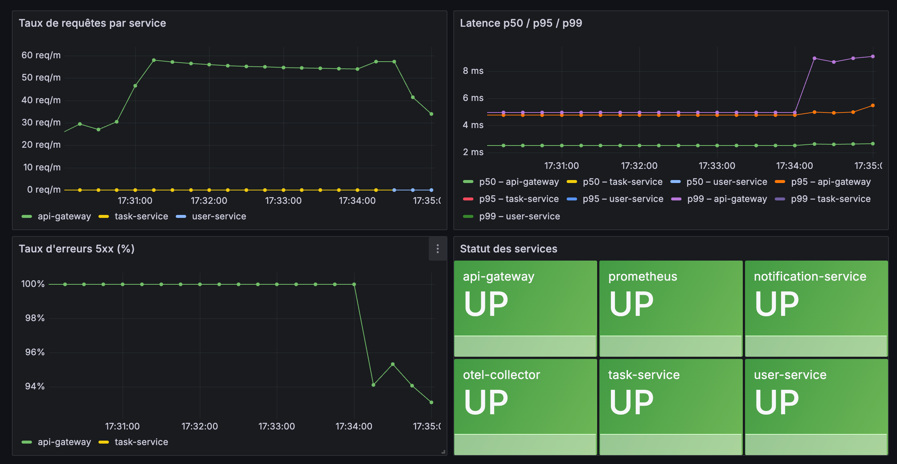
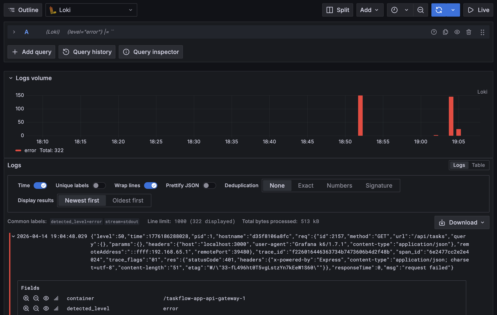
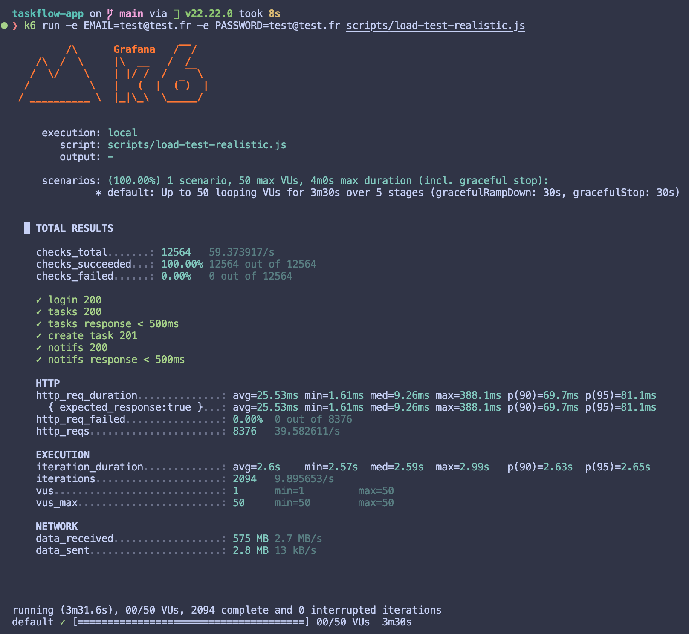
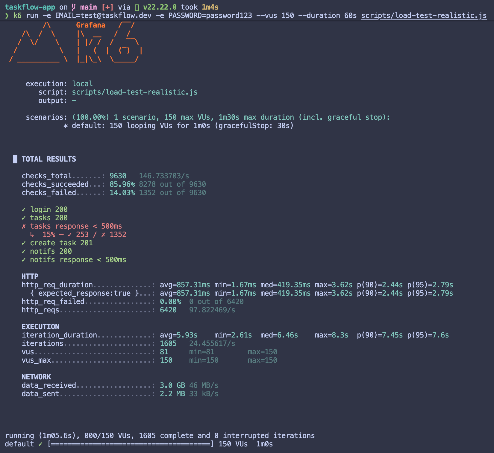
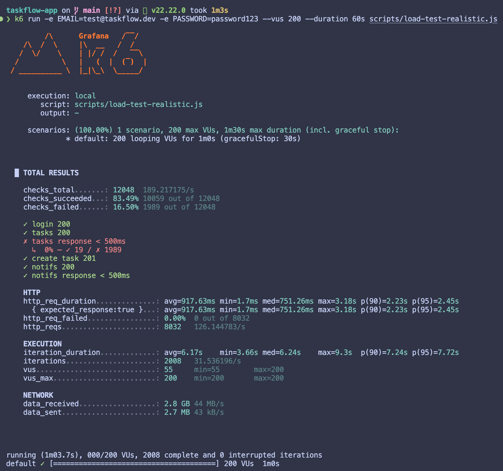
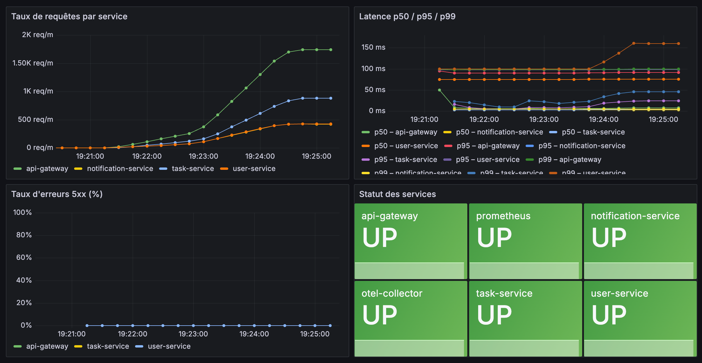
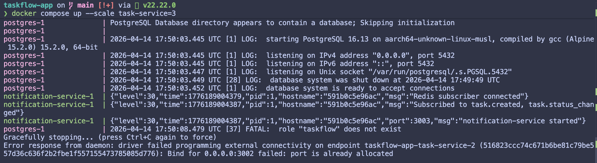
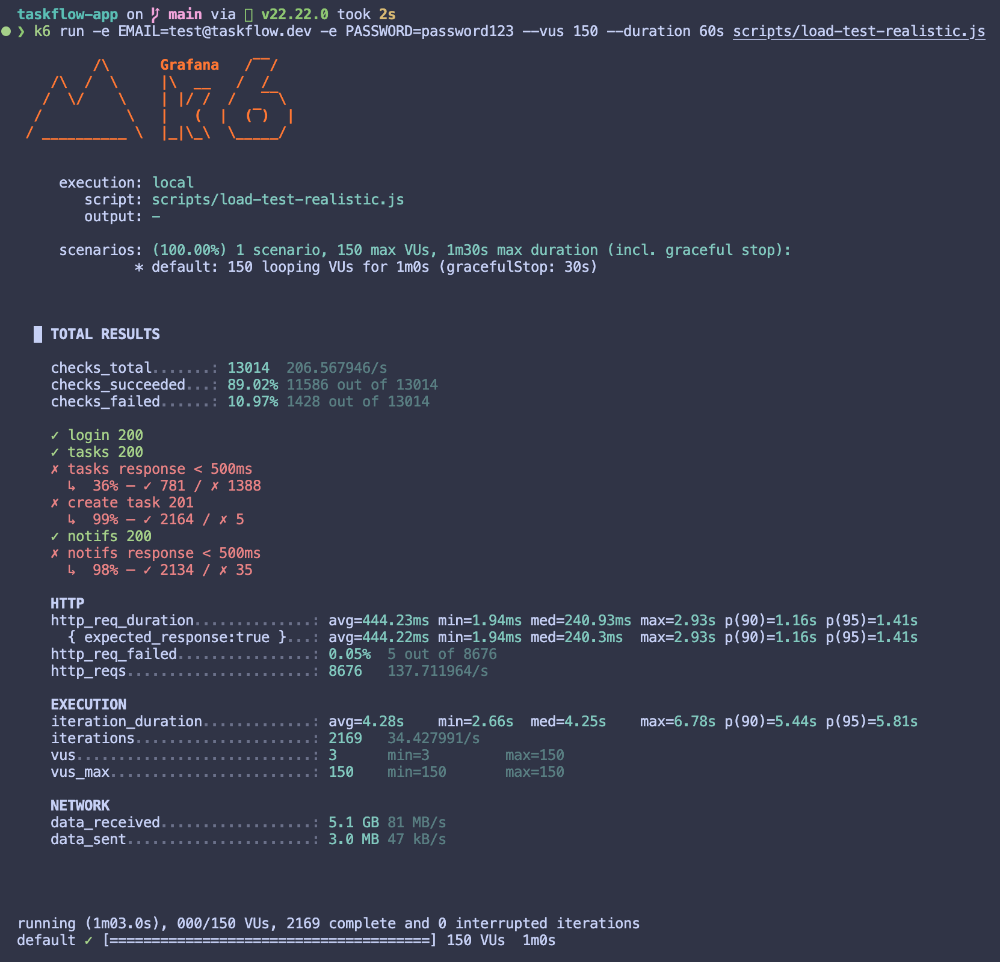

Arnaud Gaydamour - Elias El Oudghiri

# Partie 1 - Observer l'application dans Grafana

## A. Instrumenter l'application

### SDK OpenTelemetry — `tracing.js`

Chaque service expose un fichier `src/tracing.js` qui initialise le SDK avec `NodeSDK`, déclare la ressource via `new Resource({ SERVICE_NAME: serviceName })` pour identifier le service dans Tempo, et exporte les traces vers l'OTel Collector en OTLP HTTP.

Les auto-instrumentations HTTP, Express et PG sont activées via `getNodeAutoInstrumentations`. Le fichier est chargé en premier dans chaque `index.js` pour garantir que l'instrumentation est active avant tout démarrage.

Pour le shutdown propre, on écoute `SIGTERM` et `SIGINT` et on appelle `sdk.shutdown()` pour vider les buffers avant de quitter.


---

### OTel Collector — `infra/otel/config.yml`

Les receivers sont configurés en `otlp` avec gRPC (4317) et HTTP (4318). L'exporter vers Tempo utilise gRPC (`tempo:4317`), plus performant qu'HTTP pour du backend-to-backend.

Les métriques internes du collector sont exposées sur `0.0.0.0:8888` pour que Prometheus puisse les scraper. Deux pipelines sont définis : `traces` (otlp → batch → tempo + debug) et `metrics` (otlp → batch → debug).

---

### Tempo — `infra/tempo/tempo.yml`

Tempo expose son API et son UI sur le port 3200, utilisé par Grafana comme datasource. Il reçoit les traces en gRPC sur le port 4317 depuis l'OTel Collector.

Le stockage est local (`/tmp/tempo/traces`) avec un Write-Ahead Log (`/tmp/tempo/wal`), un buffer disque qui protège les traces en cas de crash avant leur écriture définitive.

---

### Prometheus — `infra/prometheus/prometheus.yml`

Le scrape interval global est de 15s. Les cibles configurées sont : `api-gateway:3000`, `user-service:3001`, `task-service:3002`, `notification-service:3003`, et `otel-collector:8888` pour les métriques internes du collector.

---

### Grafana — provisioning automatique

La datasource Prometheus (`http://prometheus:9090`) est marquée `isDefault: true`. Tempo est configuré sur `http://tempo:3200`. Le provider de dashboards charge automatiquement les JSON depuis `/var/lib/grafana/dashboards` au démarrage.

---

### docker-compose.infra.yml

Les services démarrent dans cet ordre : `tempo` → `otel-collector` → `prometheus` → `grafana`. Tempo doit être prêt avant le collector qui lui envoie des traces dès le lancement.

---

## B. Visualisation de l'application

### Métriques

Les métriques métier sont déclarées dans `metrics.js` de chaque service et instrumentées dans le code métier. Le `task-service` expose `tasks_created_total{priority}`, `tasks_status_changes_total{from_status,to_status}` et `tasks_gauge{status}` mise à jour par une requête `COUNT(*) GROUP BY status` après chaque mutation.

Le `user-service` expose `user_registrations_total` et `user_login_attempts_total{success}`. L'`api-gateway` expose `upstream_errors_total{service}` incrémenté à chaque proxy error. Le `notification-service` expose `notifications_sent_total{event_type}`.

---

### Dashboards Grafana

Les deux dashboards sont exportés dans `infra/grafana/dashboards/` et chargés automatiquement au démarrage de Grafana.

---

### Traces

#### Compréhension

La requête `POST /api/tasks` depuis le frontend génère une trace distribuée qui traverse api-gateway → task-service → PostgreSQL.


Les spans sont reliés par un `traceId` commun propagé via le header HTTP `traceparent`. L'auto-instrumentation gère la propagation sans code supplémentaire.

Sur les spans HTTP, les attributs clés sont `http.method`, `http.route` (le pattern Express, pas l'URL réelle), `http.status_code`, et `span.kind` qui vaut `SERVER` pour le service qui reçoit et `CLIENT` pour celui qui émet.

Sur les spans PostgreSQL, `db.statement` contient la requête SQL complète — utile pour détecter les requêtes lentes ou les N+1. `db.system` vaut `postgresql`, `net.peer.name` vaut `postgres`.


L'attribut `service.name` est commun à tous les spans d'un service, défini via `OTEL_SERVICE_NAME` dans `tracing.js`.

#### Ajout de spans custom

Redis/pub-sub n'est pas couvert par l'auto-instrumentation. Un span manuel est ajouté dans `task-service/src/routes.js` autour de la publication :

```js
const { trace } = require("@opentelemetry/api");
const tracer = trace.getTracer("task-service");

const span = tracer.startSpan("publish.task.created");
await publish("task.created", { taskId: task.id, title: task.title, assigneeId: task.assignee_id });
span.end();
```

Ce span apparaît dans le waterfall entre le span `POST /tasks` et la fin de la requête. On peut le retrouver dans Tempo avec :

```traceql
{ name = "publish.task.created" }
```


---

## C. Logs

### Configuration

Promtail est configuré avec `docker_sd_configs` pour lire l'API Docker et récupérer les métadonnées des conteneurs. Le pipeline extrait `level` et `msg` depuis le JSON Pino, puis convertit les niveaux numériques en strings (30→info, 40→warn, 50→error) via une `template` stage. Loki utilise le store `tsdb` (le plus récent recommandé) avec un stockage `filesystem`.

---

### Visualisation

#### Filtrer les logs du task-service

La syntaxe LogQL utilisée est `{job="task-service"}`. Le sélecteur entre accolades fonctionne comme en PromQL : on sélectionne un flux de logs par label.

La différence avec Prometheus est que LogQL opère sur des lignes de texte, pas des valeurs numériques. On peut filtrer sur le contenu (`|= "error"`), parser le format (`| json`) et extraire des champs — le résultat par défaut est un flux de logs bruts, pas un graphe.


Pour retrouver les erreurs du task-service :

```logql
{service_name="/taskflow-app-task-service-1", level="error"} |= ``
```


#### Logs d'erreur et filtrage sur statusCode 500

Logs de niveau error sur tous les services :

```logql
{job=~".+"} | json | level="error"
```

Filtrage sur les requêtes ayant retourné un 500 :

```logql
{job=~".+"} | json | statusCode=`500`
```

Dans Prometheus, `http_requests_total{status="500"}` donne un compteur agrégé — performant, indexé, conçu pour alerter. Dans Loki, on obtient la même information en parsant les logs, mais c'est plus coûteux car Loki doit lire et parser chaque ligne.

Prometheus est la bonne approche pour détecter et compter les erreurs 500. Loki est utile pour voir le détail de chaque requête en erreur — ce qu'une métrique seule ne peut pas fournir. Les deux sont complémentaires.


#### Corrélation logs ↔ traces

Le traceId relevé dans Tempo après un `POST /api/tasks` : `cb67f832b3533ede816e99f2f420738c`

On peut le retrouver dans Loki car l'auto-instrumentation OTel injecte le `trace_id` dans le contexte et Pino le logue dans le JSON :

```logql
{job=~".+"} |= "cb67f832b3533ede816e99f2f420738c"
```

Pour que ce soit automatique, il faudrait configurer les **Derived Fields** dans la datasource Loki de Grafana : une regex détecte le champ `trace_id` dans les logs et crée un lien cliquable vers Tempo.


#### Démarche d'investigation face à un pic d'erreurs

On commence par Prometheus : `rate(http_requests_total{status=~"5.."}[5m])` ventilé par `job` identifie le service concerné et la fenêtre de temps.

On bascule sur Loki pour lire les logs d'erreur du service : `{job="task-service"} | json | level="error"`. Les logs Pino donnent le message exact et la route concernée.

On prend un `trace_id` visible dans les logs et on l'ouvre dans Tempo. Le waterfall montre quelle étape a échoué dans la chaîne et combien de temps chaque span a pris.

---

# TP — Stress test avec k6

## Étape 1 — Lancer un premier test léger

**Question 1** — La latence p95 mesurée par k6 est **32.29ms**, en dessous du seuil de 200ms.



**Question 2** — `http_req_failed` est à 100%, il y a des erreurs 401, le token n'est pas transmis à la requête.




## Étape 2 — Monter la charge progressivement

**Question 3** — À 50 VUs (scénario par défaut), le check `tasks response < 500ms` ne faillit pas : p95 à 81.1ms, 0% d'échecs.



À 100 VUs, les checks passent encore. À 150 VUs, le check commence à échouer : 1352 échecs sur 1605 tentatives (14% d'échecs), avec une p95 globale à 2.79s. Le système est dégradé mais pas totalement saturé — 15% des GET tasks passent encore sous 500ms. À 200 VUs, le check s'effondre complètement : 0% de succès, p95 à 2.45s. Le seuil de rupture se situe donc autour de **150 VUs**.

**Test avec 150 vus**


**Test avec 200 vus**


**Question 4** — À chaque itération, l'API Gateway reçoit un total de 4 requêtes, qui sont ensuite distribuées de la manière suivante :
- 1 requête vers le user-service (POST login).
- 2 requêtes vers le task-service (GET tasks et POST create task).
- 1 requête vers le notification-service (GET notifications).

*Répartition du trafic :*  
Puisque l'API Gateway centralise ces 4 appels, elle supporte logiquement une charge plus lourde que les services individuels. Concrètement, elle reçoit :
- 4 fois plus de trafic que le user-service ou le notification-service (qui n'en reçoivent qu'un seul chacun).
- 2 fois plus de trafic que le task-service (qui en reçoit deux).



**Question 5** — Le `task-service` reçoit 2 requêtes par itération contre 1 pour les autres services, mais chacune de ces requêtes est coûteuse : le GET tasks fait un `SELECT` complet, le POST tasks fait un `INSERT` puis un `COUNT GROUP BY` pour la gauge, et déclenche une publication Redis.


## Étape 3 — Tester les limites de `docker scale`

**Question 6** — `docker compose up --scale task-service=3` échoue avec une erreur de port déjà alloué. La cause est le mapping statique `"3002:3002"` dans `docker-compose.yml` : les 3 replicas essaient tous de binder le même port hôte 3002, ce qui est impossible. La fix est de supprimer les ports du task-service — Docker gère les ports internes seul, et l'api-gateway accède au service via le réseau Docker interne.



**Question 7** — Après le fix, les 3 replicas démarrent et reçoivent bien du trafic dans Grafana. Les checks passent mieux qu'avant : `tasks response < 500ms` monte à 36% de succès contre 15% avant le scaling, et la p95 tombe de 2.79s à 1.41s. Le scaling a donc amélioré les métriques.

Cependant, de nouvelles erreurs apparaissent : 5 `create task 201` échoués et 35 `notifs response < 500ms` dépassés qui n'existaient pas avant. Avec 3 replicas, chacun maintient son propre pool de connexions PostgreSQL. À 150 VUs, les 3 replicas ouvrent des connexions en parallèle et peuvent atteindre la limite `max_connections` de Postgres (100 par défaut) — Postgres refuse alors de nouvelles connexions et le service retourne un 500. C'est une limite du scaling horizontal naïf : on scale l'applicatif mais la base reste un goulot partagé. En production on résoudrait ça avec un connection pooler comme PgBouncer.

En revanche, sur `http://localhost:9090/targets`, Prometheus ne voit qu'une seule target `task-service` malgré les 3 replicas. Prometheus est configuré avec l'adresse statique `task-service:3002` dans `prometheus.yml` — Docker résout ce nom DNS vers l'un des replicas de façon aléatoire, Prometheus scrape donc toujours un seul container sans avoir connaissance des deux autres.



**Question 8** — `docker scale` ne suffit pas en production pour plusieurs raisons. Il n'y a pas de service discovery : Prometheus et d'autres outils ne détectent pas automatiquement les nouvelles instances. Il n'y a pas de health check au niveau du load balancer : si un replica tombe, le trafic continue de lui être envoyé. Enfin, il n'y a aucune gestion du rolling update ou du rollback. Kubernetes résout ces problèmes avec des Deployments (scaling déclaratif avec health checks), un service discovery natif, et une intégration avec des outils comme Prometheus Operator qui détecte automatiquement les pods via des `ServiceMonitor`.
